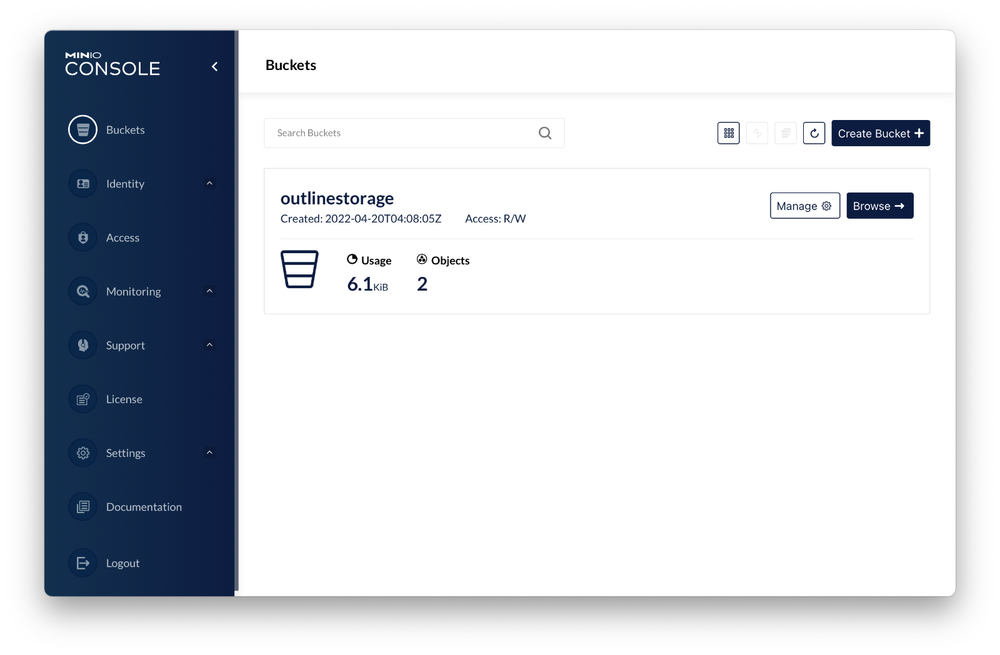

<!--
注意：此 README 由 <https://github.com/YunoHost/apps/tree/master/tools/readme_generator> 自动生成
请勿手动编辑。
-->

# YunoHost 上的 MinIO server

[](https://dash.yunohost.org/appci/app/minio)  

[](https://install-app.yunohost.org/?app=minio)

*[阅读此 README 的其它语言版本。](./ALL_README.md)*

> *通过此软件包，您可以在 YunoHost 服务器上快速、简单地安装 MinIO server。*  
> *如果您还没有 YunoHost，请参阅[指南](https://yunohost.org/install)了解如何安装它。*

## 概况

MinIO is a High Performance Object Storage released under GNU Affero General Public License v3.0. It is API compatible with Amazon S3 cloud storage service. Use MinIO to build high performance infrastructure for machine learning, analytics and application data workloads.

## How to create a Yunohost app using MinIO
During the install process, MinIO will install both the MinIO server and MinIO client.
If your app needs to use an Amazon S3 storage, I recommend to use the MinIO client to create and setup buckets as per your app's requirements. You can have a look at outline_ynh app for reference.

### First step: retrieve MinIO credentials
```
#=================================================
# SETUP MINIO CREDENTIALS
#=================================================
minio_domain=$(ynh_app_setting_get --app="minio" --key=domain)
minio_admin=$(ynh_app_setting_get --app="minio" --key=admin)
minio_password=$(ynh_app_setting_get --app="minio" --key=password)
mc_path=$(ynh_app_setting_get --app="minio" --key=mc_path)
```

### Second step: create and setup your bucket
```
#=================================================
# SETUP MINIO BUCKET
#=================================================
ynh_script_progression --message="Setting up MinIO bucket for YOURAPP..." --weight=1

pushd "$mc_path"
	ynh_exec_warn_less sudo -u minio ./mc mb minio/NAME_OF_YOUR_BUCKET --region "NAME_OF_YOUR_REGION"
	ynh_exec_warn_less sudo -u minio ./mc policy set NEEDED_POLICY minio/NAME_OF_YOUR_BUCKET
popd
```

**分发版本：** 2023.09.07~ynh1

## 截图



## 文档与资源

- 官方应用网站： <https://min.io>
- 官方管理文档： <https://docs.min.io/>
- 上游应用代码库： <https://github.com/minio/minio>
- YunoHost 商店： <https://apps.yunohost.org/app/minio>
- 报告 bug： <https://github.com/YunoHost-Apps/minio_ynh/issues>

## 开发者信息

请向 [`testing` 分支](https://github.com/YunoHost-Apps/minio_ynh/tree/testing) 发送拉取请求。

如要尝试 `testing` 分支，请这样操作：

```bash
sudo yunohost app install https://github.com/YunoHost-Apps/minio_ynh/tree/testing --debug
或
sudo yunohost app upgrade minio -u https://github.com/YunoHost-Apps/minio_ynh/tree/testing --debug
```

**有关应用打包的更多信息：** <https://yunohost.org/packaging_apps>
